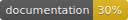

# RKTableAdapter

[](https://travis-ci.org/DaskiOFF/RKTableAdapter)
[](https://cocoapods.org/)
[](https://daskioff.github.io/RKAutoLayout/)
[](https://cocoapods.org/pods/RKTableAdapter)
[](https://cocoapods.org/pods/RKTableAdapter)
[](https://developer.apple.com/swift)
[](https://cocoapods.org/pods/RKTableAdapter)

## Content
- [Requirements](#requirements)
- [Documentations](#documentations)
- [Installation](#installation)
- [Usage TableViewAdapter with UITableView](#usage-tableviewadapter-with-uitableview)
- [Usage CollectionViewAdapter with UICollectionView](#usage-collectionviewadapter-with-uicollectionview)
- [Cell Templates](#cell-templates)
    - [Usage templates](#usage-templates)
- [Author](#author)
- [License](#license)
- [Info](#dependencies)

## Requirements

- iOS 9.0 and above
- Swift 4.1

## Documentations

Full documentation for the latest release is available [here](https://daskioff.github.io/RKTableAdapter/)

## Installation

RKTableAdapter is available through [CocoaPods](https://cocoapods.org). To install
it, simply add the following line to your Podfile:

```ruby
pod 'RKTableAdapter', '~> 0.1'
```

## Usage TableViewAdapter with UITableView 

- Create cell and cellViewModel ([Example template](https://github.com/DaskiOFF/jessica_templates/tree/rk_table_adapter/cell/code))
- [Example template for ViewCOntroller with TableViewAdapter](https://github.com/DaskiOFF/jessica_templates/blob/rk_table_adapter/table_vc/code/VC.swift)

#### Manual create/update ViewController
- Create TableViewAdapter
```swift
// Create
let tableView: UITableView = UITableView()
lazy var tableAdapter = TableViewAdapter(tableView: self.tableView)
```
- Setup callbacks if needed
```swift
private func setupTableAdapter() {
    // tableAdapter.callbacks...
    // tableAdapter.scrollViewCallbacks...
}
```
- Configure content
```swift
private func configureTableAdapterContent() {
    let tableList = TableList()

    makeMySection(tableList)

    tableAdapter.reload(with: tableList)
}

private func makeMySection(_ list: TableList) {
    let section = list["mySection"]
    section.headerHeight = 30
    section.footerHeight = 40

    do {
        let viewModel = TableSwitchCellVM(title: "Autosave", isOn: true)
        vmAutosave.changeAction = autosaveStateChanged

        let switchRow = TableRowSwitch(viewModel: vmAutosave)
        section.append(row: switchRow)
    }

    do {
        let vm = MenuItemCellVM(title: "Share", action: share)
        section.append(row: TableRow<MenuItemCell>(id: "uniq id", viewModel: vm))
    }
}
```
- Add actions
```swift
private lazy var share: TableCellVM.ActionType = { [weak self] userInfo in
    guard let sself = self else { return }

    // do smth...
}
```
- Update viewDidLoad
```swift
override viewDidLoad() {
    super.viewDidLoad()

    setupTableAdapter()
    configureTableAdapterContent()
}
```

## Usage CollectionViewAdapter with UICollectionView
- [Example template for ViewCOntroller with CollectionViewAdapter](https://github.com/DaskiOFF/jessica_templates/blob/rk_table_adapter/collection_vc/code/VC.swift)
- Create cell and cellViewModel ([Example template](https://github.com/DaskiOFF/jessica_templates/tree/rk_table_adapter/collection_cell/code))

#### Manual create/update ViewController
- Create ColelctionViewAdapter
```swift
// Create
lazy var collectionViewFlow: UICollectionViewFlowLayout = {
        let flow = UICollectionViewFlowLayout()
        // configure flow layout
        return flow
    }()
    lazy var collectionView: UICollectionView = {
        let cv = UICollectionView(frame: .zero, collectionViewLayout: collectionViewFlow)
        // configure collection view
        return cv
    }()
lazy var collectionAdapter = CollectionViewAdapter(collectionView: collectionView)
```
- Setup callbacks if needed
```swift
private func setupCollectionAdapter() {
    // collectionAdapter.callbacks...
    // collectionAdapter.scrollViewCallbacks...
}
```
- Configure content
```swift
private func configureCollectionAdapterContent() {
    let collectionList = CollectionList()
    
    makeTestSection(collectionList)

    collectionAdapter.reload(with: collectionList)
}

private func makeTestSection(_ list: CollectionList) {
    let section = list[SectionIds.diary.rawValue]
    
    do {
        // let vm = <#Collection Cell VM#>
        // vm.action = collectionCellAction
        // section.append(row: TableRow<<#Collection Cell Class#>>(id: "uniq id", viewModel: vm))
    }
}
```
- Add actions
```swift
private lazy var collectionCellAction: CollectionCellVM.ActionType = { [weak self] _ in
    guard let sself = self else { return }
    
    print("cell taped")
}
```
- Update viewDidLoad
```swift
override viewDidLoad() {
    super.viewDidLoad()

    setupCollectionAdapter()
    configureCollectionAdapterContent()
}
```

## Templates
Generate Cells and ViewControllers from templates with [Jessica](https://github.com/daskioff/jessica)

Download templates

```
jessica generator pull github.com/daskioff/jessica_templates rk_table_adapter
```

Fix `output_paths` in `templates.yml` for your project

### Usage templates

[Jessica Generator](https://github.com/DaskiOFF/jessica#generator)

```
jessica generator gen cell CELL_NAME

or

jessica generator gen cell_calc CELL_NAME
```

## Author

DaskiOFF, waydeveloper@gmail.com

## License

RKTableAdapter is available under the MIT license. See the [LICENSE](LICENSE) file for more info.

## [Dependencies](https://ios-factor.com/dependencies)
Последний раз проект собирался с версией **Xcode** указанной в файле ```.xcode-version``` ([Подробнее](https://github.com/fastlane/ci/blob/master/docs/xcode-version.md))

Последний раз проект собирался с версией **Swift** указанной в файле ```.swift-version```
